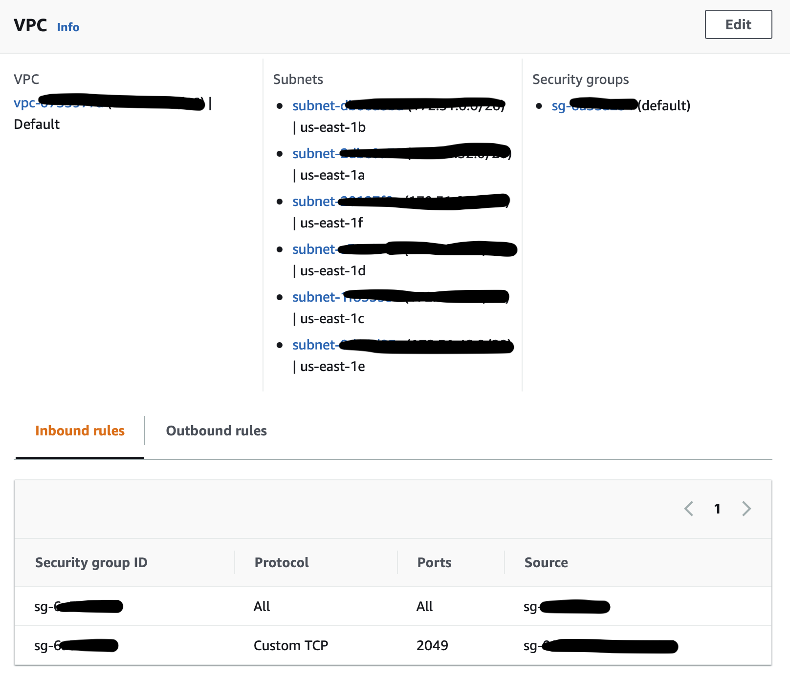
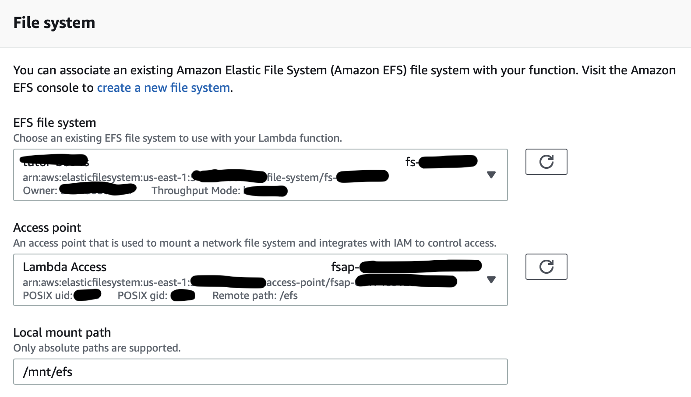
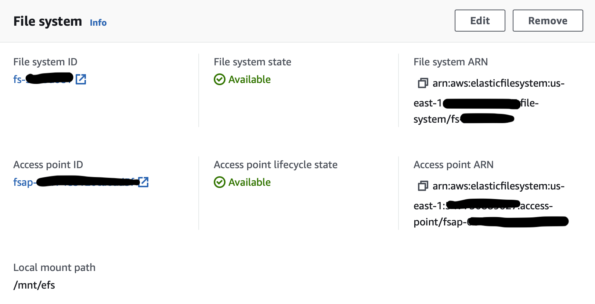

# Lambda
This section details the Lambda AWS service, key features/configuration to be aware of, and the code written for communication with the Lex service.

**Note**: In-depth description of the code is provided in the code files themselves.

## Code Description
Two files are in this section, each with key functionality. 
- **lambda_function.py**: Contains the 'runnable' lambda code, handling input events from Lex and distributing the tasks accordingly based upon user "intent" (more on that in the `Lex` directory). 
- **knowledge_graph.py**: Contains the code designed to generate 'smart' predictions for lessons navigation. The itself contains functions called in the `lambda_function.py` file but does not run any of its own code.

## VPC/EC2/EFS Configuration
In order to access the files in the EFS via Lambda, it is required to link Lambda to a VPC (Virtual Private Cloud). Every AWS account has a pre-generated VPC that contains the processes and services that the account has set up.

**Note**: Before following these steps, make sure you have EFS/EC2 set up and and access point set up on your EFS instance. Please visit the `EFS` and `EC2` folders for information on that.

1. Ensure VPC is set up in the "Configuration" menu of Lambda under the "VPC" tab. When set up, the VPC menu will look like this:

2. Ensure you have linked EFS in the "Configuration" menu as well, under the "File Systems" tab. The setup menu will look like this:

3. In the "Local mount path" section, you can provide any path as long as it is in the `/mnt/` folder. It will be important to note later, that this path needs to be added to your lambda system path (done in the `lambda_function.py` file).

4. When you have the EFS successfully linked, the "File Systems" tab will look like this:

## Security Group Configuration

Security groups are required in Lambda to provide credentials to the service it wishes to access. It is important to create a security group with the `AWSLambdaVPCAccessExecutionRole` which will provide Lambda with the necessary permission to access the EC2 instance which grants access to the EFS mount point.